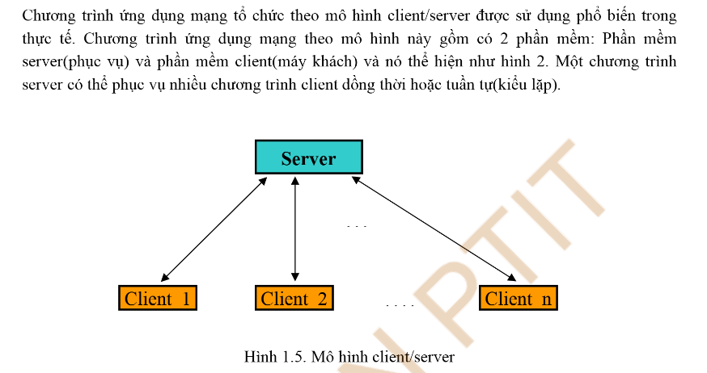
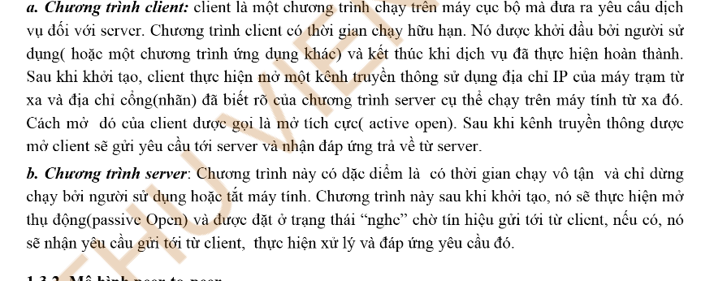

# 🚀 Bài Tập Lớn Lập Trình Mạng

## 📋 Đề Tài

> _Chưa cập nhật_

---

## 👨‍💻 Thành Viên Nhóm

| STT | Họ và tên         | MSSV            | Ghi chú |
| --- | ----------------- | --------------- | ------- |
| 1   | Nguyễn Tuấn Anh   | B22DCDT019      |         |
| 2   | Nguyễn Tùng Dương | _Chưa cập nhật_ |         |
| 3   | Nguyễn Đức Khải   | _Chưa cập nhật_ |         |

---

## 🗓️ Kế Hoạch Học Tập

### 1. Mô Hình Triển Khai Phần Mềm

<p align="center">
  
</p>

- **Client** <--> **Server**

<p align="center">
  
</p>

### 2. Client (Frontend)

- Gửi các request tới server.
- Học các kiến thức liên quan đến reactjs
- Học các kiến thức liên quan đến call api và map api
- Đề xuất các thư viện sử dụng: axios , useEffect + useState hoặc ReactQuery(Tanstack)

### 3. Server (Backend)

- Xử lý và gửi các response về client.
- OOP cơ bản
- Cách tổ chức thư mục
- Các khái niện cơ bản về HTTP methods (GET - POST - PUT - PACTH - DELETE)
- Chọn bất kỳ một framework backend (Nestjs hoặc Spring boot)
- Cách kết nối đến csdl (MongoDB/PostgreeSql)
- Viết API CRUD đơn giản

---

## I. Tổng Quan Hệ Thống

_(Bổ sung mô tả tổng quan hệ thống tại đây)_

---

## II. Công Nghệ Sử Dụng

- Ngôn ngữ lập trình: _(Cập nhật)_
- Framework: _(Cập nhật)_
- Thư viện: _(Cập nhật)_

---

## III. Hướng Dẫn Cài Đặt

1. **Clone repository:**
   ```bash
   git clone https://github.com/dezaikhongsai/BTL_LAP_TRINH_MANG.git
   ```
2. **Cài đặt dependencies:**

   ```bash
   # Ví dụ với Node.js
   cd .\backend\
   npm install
   cd ..
   cd .\frontend\

   npm install
   ```

3. **Chạy ứng dụng:**
   ```bash
   # Ví dụ với Node.js
   cd .\backend\
   npm run dev
   ```

---

## 📞 Liên Hệ

- Email: [dezaikhongsai10012004@gmail.com](mailto:dezaikhongsai10012004@gmail.com)
- Github: [dezaikhongsai](https://github.com/dezaikhongsai)
- Facebook:[https://www.facebook.com/nguyen.tuan.anh.592841]

---
