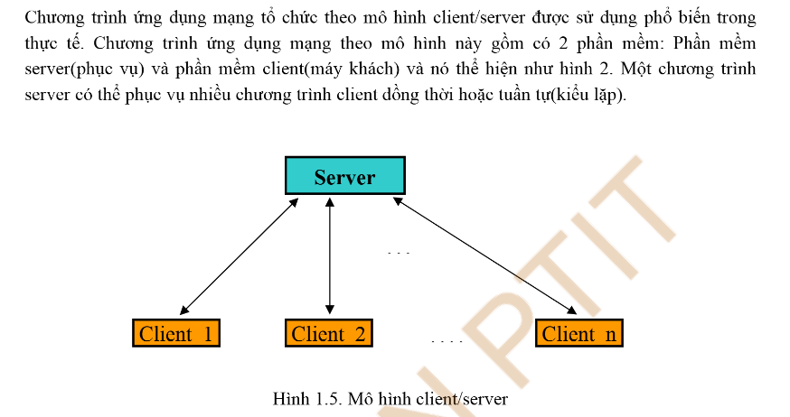
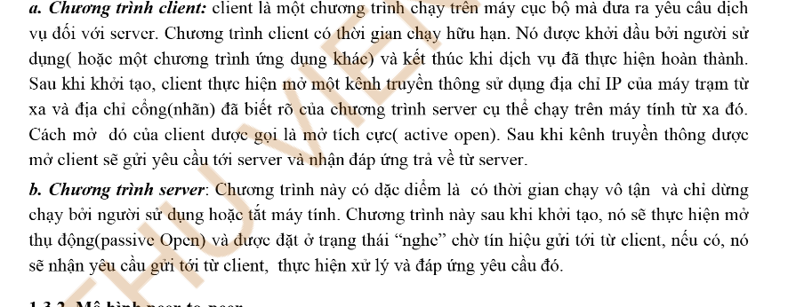

# Bài tập lớn lập trình mạng

## Đề tài : Chưa cập nhật

Danh sách thành viên :

1. Nguyễn Tuấn Anh - B22DCDT019
2. Nguyễn Tùng Dương - chưa cập nhật
3. Nguyễn Đức Khải - chứa cập nhật

### Kế hoạch học tập

1. Mô hình triển khai phần mềm
   

- Client <--> Server

2. Client (Frontend)

- Client gửi các request tới server

3. Server (Backend)

- Server gửi các respone về client

### I. Tổng quan hệ thống

### II. Công nghệ sử dụng

### III. Hướng dẫn cài đặt
